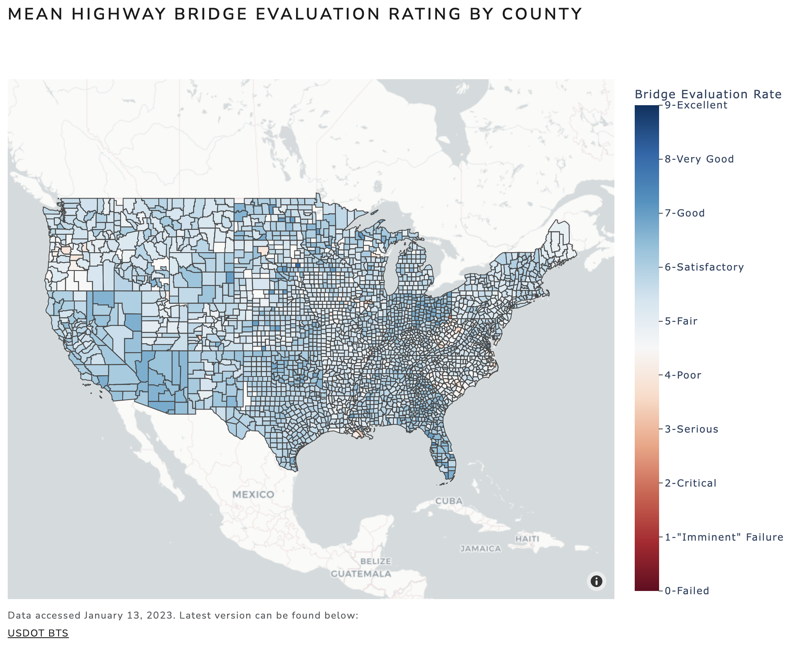
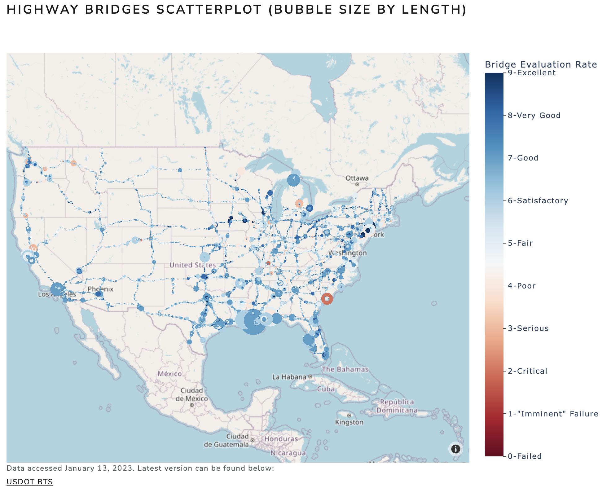
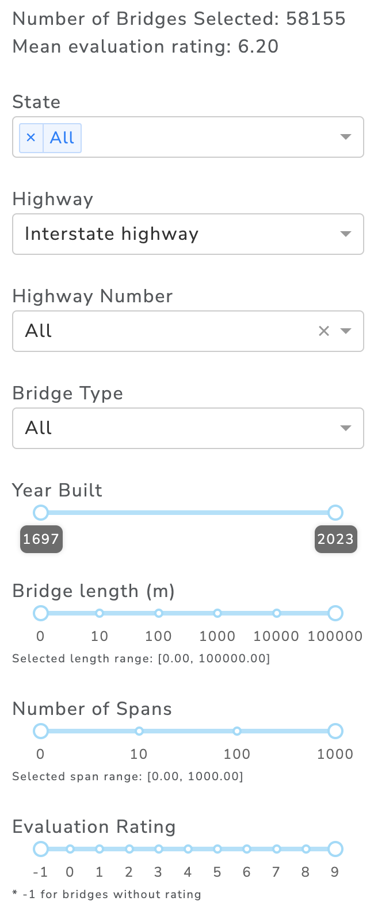

# BridgeMap
## Overview

This repository contains the `BridgeMap` dashboard project. The project aims to create an application that allows potential users to visualize US Interstate, US Numbered, and State highway bridges as either a heatmap showing the evaluation statistics by county or scatterplot of individual bridges. The dashboard uses the `National Bridge Inventory` dataset, accessed on January 13, 2023. This dataset is maintained by the US Federal Highway Administration and the latest version can be found [here](https://geodata.bts.gov/datasets/national-bridge-inventory/about). Detailed descriptions of all the features included in this dataset can be found in the [Recording and Coding Guide for the Structural Inventory and Appraisal of the Nation's Bridges](https://www.fhwa.dot.gov/bridge/nbi.cfm)

## Who am I and who should use this dashboard?

I am a master student at the University of British Columbia enrolled in the Master of Data Science program (MDS). I am also a trained structural engineer and for a while now, I have been trying to visualize the 'scale' of critical infrastructure in the US in terms of number, size, and its structural evaluation. This dashboard was created in part as a personal project and also to fulfill the requirement of the MDS program.

A similar dashboard maintained by the Bureau of Transportation Statistics can be found [here](https://www.arcgis.com/home/item.html?id=a0fa29a39fe444ac97d4337c569b9801). This official dashboard contains all the information on all the entries in the database, which makes it quite difficult to use (over 620,000 entries). Unlike the official dashboard, the `BridgeMap` app aims to make an intuitive, easy-to-use map based application for quick references. This app is intended for people who are interested in civil infrastructure, in particular, highway bridges. This may be other structural engineers who want a quick and easy way to look up a bridge, or engineering students who want to visualize the scale of critical infrastructure in the US.

## Dashboard Functionality 

This dashboard contains two tabs, a heatmap showing the mean evaluation rating by county, and a scatterplot of bridges with bubble sizes indicating the length of the structure. The live app can be accessed [here](https://bridgemap.onrender.com).

### Heatmap 


### Scatterplot


### User Input

The user has 8 selection options, `state`, `type of highway`, `highway number` (filtered by the type), `bridge type`, `year built`, `bridge length (m)`, `number of spans`, and `Evaluation Rating`. The heatmap or scatterplot will then update based on user selection. A count of the number of bridges selected as well as the selection's mean evaluation rating will be displayed at the top of the panel.


## Continuous Development 

Want to help improve this app? Please check out the [contributing guidelines](https://github.com/austin-shih/BridgeMap/blob/main/CONTRIBUTING.md) and [code of conduct](https://github.com/austin-shih/BridgeMap/blob/main/CODE_OF_CONDUCT.md).

Below are the steps to setup the development environment for BridgeMap:

1. Fork the [BridgeMap] <https://github.com/austin-shih/BridgeMap> repo on GitHub.

2. Clone your fork and use `git` (or similar) to create a development branch:
    ```console
    git switch -c name-of-your-bugfix-or-feature
    ```

3. Create conda environment and activate it
    ``` console
    conda env create -f bridgemap.yaml
    conda activate bridgemap
    ```

4. The `app.py` scipt contains the dashboard scripts in `plotly dash`.

5. Start contributing! The [Plotly Dash Python User Guide](https://dash.plotly.com/) is a great online resource for reference.
## License

Please refer to the License File [here](https://github.com/austin-shih/BridgeMap/blob/main/LICENSE)
