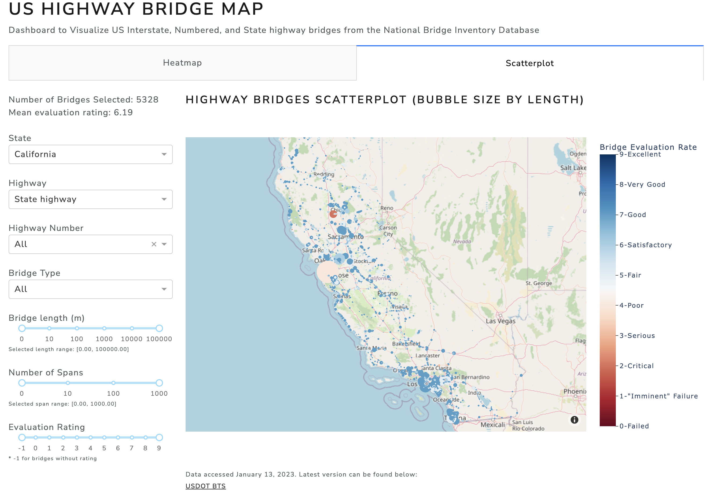
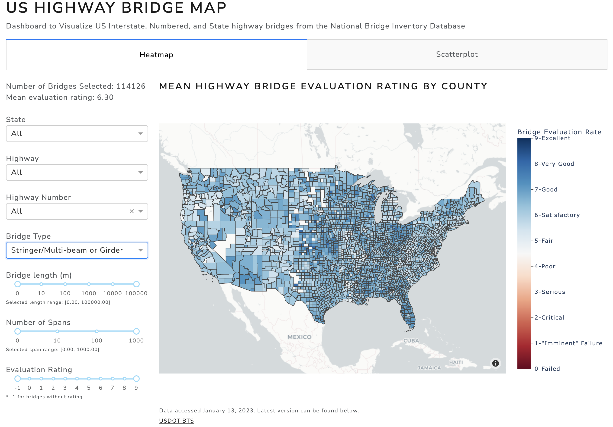

# BridgeMap - Proposal

## Motivation and Purpose

Our role: Engineering consultancy

Target audience: Engineers, government infrastructure agency, civil engineering researchers

I am a structural engineer and for a while now, I have been trying to visualize the 'scale' of critical infrastructure in the US in terms of number, size, and its structural evauluation. Luckily, the US Federal Highway Administration maintains an extremely detailed database of every single bridge, culvert, tunnel accessible to the general public. A similar dashboard maintained by the Bureau of Transportation Statistics can be found [here](https://www.arcgis.com/home/item.html?id=a0fa29a39fe444ac97d4337c569b9801). This official dashboard contains all the information on all the entries in the database, which makes it quite difficult to use. Unlike the official dashboard, the BridgeMap app aims to make an intuitive, easy-to-use map based application for quick references. The BridgeMap app is intended for people who are interested in civil infrastructure, in particular, highway bridges. This may be other structural engineers who want a quick and easy way to look up a bridge, or government infrastructure agencies who want to quickly identify critical bridges.

## Description of Data

This app visualizes the `National Bridge Inverntory` (NBI) dataset, which is actively maintained by the US Federal Highway Administration. A version of this dataset was accessed on January 13, 2023 and is used for this app. The latest version can be found [here](https://geodata.bts.gov/datasets/national-bridge-inventory/about). A detailed breakdown of what this dataset contains is documented in the [Recording and Coding Guide for the Structural Inventory and Appraisal of the Nation's Bridges](https://www.fhwa.dot.gov/bridge/nbi.cfm). Due to the size of this dataset (over 620,000 enteries), this app will focus on US Interstate, US Numbered, and State Highways (approximately 260,000 entries).

The dataset includes 127 columns containing information such as the location, length, width, type, evaulation rating, etc., of every single publicly accessible 'crossing' in the US. For the purposes of this dashboard, which focuses on providing general information, the columns containing the following values will be used: `latitude`, `longitude`, `FIPS code`, `route type`, `route number`, `intersecting feature`, `owner`, `year built`, `evaluation rating`, `deck condition`, `superstructure condition`, `substructure condition`, `bridge material`, `bridge type`, `approach material`, `approach type`, `number of spans`, `number of approaches`, `max span length`, `bridge length`, `bridge width`.

## Research Questions and Usage Scenarios

### Research Questions

As aforementioned, the goal in creating this app is to provide an intuitive map reference to the NBI. This app will focus on the following research questions in the development of the dashboard:

1. What is the average evaluation rating of 'crossings' in the US by county or state?
2. Where are all the suspension bridges on the US Interstate Highway system located?
3. What is the average bridge evaluation rating by county for bridges on the State Highway system?
4. What is the average bridge evaluation rating for all of the concrete girder bridges?

### Usage Scenarios

Say you are an engineer working for a California State department of transportation. During the annual review of the state bridge asset inventory, you need to look up which State Highway bridges are at the lower end of the evaulation rating scale for inspection purposes. This app will allow you to quickly look up all the State Highway bridges and allow you to filter for evaluation rating and plot the locations of those bridges on a map. You can then use this information as a reference determine which bridges to focus on and prioritize your efforts.

### App Example

